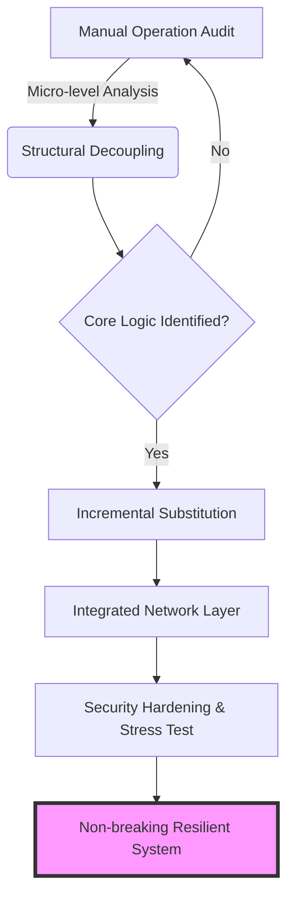

# VISNNARA: A Systematic Operation Architecture Framework
> **Architecting Resilience. Automating Precision.**

---

## 🏗 Overview
**VISNNARA** သည် လုပ်ငန်းလည်ပတ်မှုယန္တရား (Business Operations) များ၏ အောက်ခြေအဆင့် (Micro/Nano level) အထိ လေ့လာဆန်းစစ်ပြီး၊ နည်းပညာဖြင့် စနစ်တကျ ပြန်လည်တည်ဆောက်သည့် **Operational Framework** တစ်ခုဖြစ်သည်။ ဤ Framework ကို **Soe Nyi Nyi Aung** မှ အခြေခံကျသော စနစ်များ မပြိုလဲစေရန်နှင့် လုံခြုံစိတ်ချရသော ဒစ်ဂျစ်တယ်ကူးပြောင်းမှုများအတွက် ဖန်တီးခဲ့သည်။

---

## 💎 The 8 Core Pillars
VISNNARA ၏ ဒေါက်တိုင် ၈ ခုသည် စနစ်တစ်ခု၏ DNA အဖြစ် အလုပ်လုပ်သည်-

| Pillar | Concept | Detail Analysis |
| :--- | :--- | :--- |
| **V** | **Visionary** | Scalability နှင့် အနာဂတ် Data Trend များကို Predictive ဖြစ်အောင် တွက်ချက်ခြင်း။ |
| **I** | **Integrated** | Silo ဖြစ်နေသော ဒေတာများကို Unified Ecosystem တစ်ခုအောက်သို့ စုစည်းခြင်း။ |
| **S** | **Systematic** | Deterministic process များဖြင့် Human Error ကို လျှော့ချခြင်း။ |
| **N** | **Non-breaking** | High Availability (HA) နှင့် Zero-downtime deployment strategies။ |
| **N** | **Network** | Nodes များအကြား လုံခြုံချောမွေ့သော Communication Layer တည်ဆောက်ခြင်း။ |
| **A** | **Architecture** | Security-by-design နှင့် Clean Architecture Principles များ။ |
| **R** | **Resilient** | Disaster Recovery နှင့် Self-healing mechanisms များ ပါဝင်မှု။ |
| **A** | **Apparatus** | အထက်ပါအချက်များကို အကောင်အထည်ဖော်သည့် Core Software/Hardware Tools များ။ |

---

## 📊 System Workflow Diagram
VISNNARA Framework သည် လုပ်ငန်းတစ်ခုကို မည်ကဲ့သို့ ပြောင်းလဲပေးသည်ကို အောက်ပါ Mermaid Diagram ဖြင့် ကြည့်နိုင်သည်-

---

## 👨‍💻 Author & Credits
This framework is developed and maintained by:

* **Name:** Soe Nyi Nyi Aung
* **Role:** Operation Architect & Security-focused Developer
* **Framework:** VISNNARA (Visionary Integrated Systematic Non-breaking Network Architecture Resilient Apparatus)
* **Official Profile:** [https://cherrylandtaunggyi.com/developer.html](https://cherrylandtaunggyi.com/developer.html)

### 🔗 Social Connections
| Platform | Link |
| :--- | :--- |
| **LinkedIn** | [Soe Nyi Nyi Aung](https://www.linkedin.com/in/soe-nyi-nyi-aung-86a90a264) |
| **Facebook** | [Developer Profile](https://www.facebook.com/share/p/1bG5rzEn3S/) |
| **Website** | [Cherryland Taunggyi](https://cherrylandtaunggyi.com) |

---
> "Systematic approach to complex operations, secured by logic, driven by innovation." 
> — **Soe Nyi Nyi Aung**
